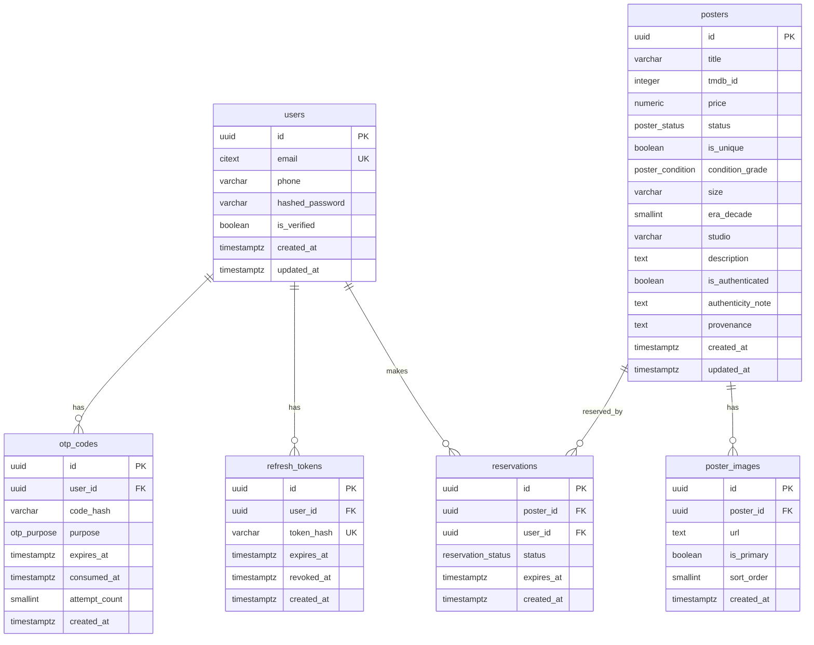

# Database Design — Poster Nung Backend (PostgreSQL)

> ขอบเขต: **Core F1–F3** (Authentication, Poster Catalog, Cart & Reservation)
> โมเดล: **Single-store MVP โดยเจตนา** (เสร็จไว, ไม่ over-engineer) — ออกแบบให้ขยายเป็น multi-vendor marketplace ได้แบบ additive ในอนาคต (ดู §8 Evolution Path)
> Deliverable: design doc + ERD (ยังไม่แตะ SQLAlchemy models)
> Source of truth: `CLAUDE.md` feature templates F1–F3
> PostgreSQL 16 (ตาม `docker-compose.yml`)

---

## 1. Overview

Backend REST API ของ e-commerce ขายโปสเตอร์หนังต้นฉบับ **ชิ้นเดียวในโลก (สต็อก=1)** ทำให้ schema ต้องรองรับ 2 ความเสี่ยงหลัก:

1. **Unique inventory** — 1 โปสเตอร์ = 1 ชิ้น ห้ามถูกจอง/ขายซ้อน → กันด้วย **row-lock (`FOR UPDATE`) + partial unique index** (2 ชั้น)
2. **ไม่มีข้อมูลบัตรดิบ** — payment อยู่ F4 (นอก scope) แต่ core schema ต้องไม่มี field การเงินอ่อนไหวหลุดเข้ามา

ตารางในรอบนี้: `users`, `otp_codes`, `refresh_tokens`, `posters`, `poster_images`, `reservations`

---

## 2. Conventions (ใช้ทุกตาราง)

| หัวข้อ | มาตรฐาน |
|---|---|
| Primary key | `id UUID` default `gen_random_uuid()` (built-in ตั้งแต่ PG13 — ไม่ต้องพึ่ง extension) |
| Money | `NUMERIC(12,2)` + `CHECK (>= 0)` |
| Timestamp | `TIMESTAMPTZ` เสมอ (ไม่ใช้ naive `timestamp`); `created_at` / `updated_at` default `now()` |
| Foreign key | ระบุ `ON DELETE` ชัดเจน — `CASCADE` สำหรับ child ที่ตายตามได้, `RESTRICT` สำหรับ reference สำคัญ |
| Naming | table = พหูพจน์ snake_case, FK = `<parent>_id`, index = `ix_<table>_<cols>`, unique = `uq_<table>_<cols>` |

---

## 3. Enum Types

```sql
CREATE TYPE poster_status      AS ENUM ('available', 'reserved', 'sold');
CREATE TYPE reservation_status AS ENUM ('active', 'expired', 'converted');
CREATE TYPE otp_purpose        AS ENUM ('registration', 'login');
CREATE TYPE poster_condition   AS ENUM ('mint', 'near_mint', 'very_fine', 'fine', 'very_good', 'good', 'fair', 'poor');
```

> ⚠️ **ยืนยันสเกลก่อน finalize:** ค่าใน `poster_condition` ข้างบนอิงเกรดเชิงพรรณนาที่ใช้กันในวงการ (แนว Heritage Auctions) แต่ยังมีระบบตัวเลข **C1–C10** ที่นิยมเช่นกัน — ควรยืนยันมาตรฐานที่นักสะสมไทย/สากลยอมรับก่อนล็อค (ตรงกับ Open Question ใน PRD) ประเด็นหลักคือ **ต้องเป็น enum เดียวทั้งระบบ** ไม่ใช่ free-text (BR-03) เพื่อให้ marketplace ในอนาคตเทียบสภาพข้ามผู้ขายได้

| enum | ค่า | ใช้ที่ |
|---|---|---|
| `poster_status` | `available` · `reserved` · `sold` | `posters.status` |
| `reservation_status` | `active` · `expired` · `converted` | `reservations.status` |
| `otp_purpose` | `registration` · `login` | `otp_codes.purpose` |
| `poster_condition` | `mint` · `near_mint` · `very_fine` · `fine` · `very_good` · `good` · `fair` · `poor` | `posters.condition_grade` |

---

## 4. Tables

### 4.1 `users` — F1 Authentication

| column | type | constraint | หมายเหตุ |
|---|---|---|---|
| `id` | UUID | PK, default `gen_random_uuid()` | |
| `email` | CITEXT | UNIQUE, NOT NULL | case-insensitive unique |
| `phone` | VARCHAR(20) | NULL | |
| `hashed_password` | VARCHAR(255) | NOT NULL | bcrypt hash เท่านั้น |
| `is_verified` | BOOLEAN | NOT NULL default `false` | ผ่าน OTP แล้ว |
| `created_at` | TIMESTAMPTZ | NOT NULL default `now()` | |
| `updated_at` | TIMESTAMPTZ | NOT NULL default `now()` | |

- `email` ใช้ **CITEXT** เพื่อกันสมัครซ้ำแบบ `A@x.com` vs `a@x.com` (ต้องเปิด extension `citext`)
- ห้ามมี field รหัสผ่านดิบ — เก็บแค่ `hashed_password`
- Index: unique บน `email` (มาจาก UNIQUE โดยปริยาย)

---

### 4.2 `otp_codes` — F1 (verify + rate-limit 5 ครั้ง/10 นาที)

| column | type | constraint | หมายเหตุ |
|---|---|---|---|
| `id` | UUID | PK | |
| `user_id` | UUID | FK → `users(id)` ON DELETE CASCADE, NOT NULL | |
| `code_hash` | VARCHAR(255) | NOT NULL | hash ของ OTP ห้ามเก็บ/log ค่าดิบ |
| `purpose` | otp_purpose | NOT NULL default `'registration'` | |
| `expires_at` | TIMESTAMPTZ | NOT NULL | |
| `consumed_at` | TIMESTAMPTZ | NULL | เวลาที่ใช้ OTP สำเร็จ |
| `attempt_count` | SMALLINT | NOT NULL default `0` | นับครั้งกรอกผิดของ code นี้ |
| `created_at` | TIMESTAMPTZ | NOT NULL default `now()` | |

- **เก็บ `code_hash` ไม่เก็บ OTP ดิบ** (ปฏิบัติเดียวกับ password) — สอดคล้องกฎ "ห้าม log payment token/password"
- **Lockout กัน brute-force (OWASP: Broken Authentication):** OTP 6 หลักมีแค่ 1,000,000 คอมโบ ต้องล็อกเมื่อกรอกผิดเกิน threshold ที่ service layer — เมื่อ `attempt_count >= 5` สำหรับ code เดียว → invalidate code นั้น (บังคับขอใหม่) และคืน 429 ห้ามปล่อยให้เดาไม่จำกัด
- **Rate-limit** ทำที่ service layer โดยนับ row ใน window:
  ```sql
  SELECT count(*) FROM otp_codes
  WHERE user_id = :user_id AND created_at > now() - interval '10 minutes';
  -- ถ้า >= 5 → block (429)
  ```
- Index: `ix_otp_codes_user_created (user_id, created_at DESC)`

---

### 4.3 `refresh_tokens` — F1 (*optional แต่แนะนำ*)

| column | type | constraint | หมายเหตุ |
|---|---|---|---|
| `id` | UUID | PK | |
| `user_id` | UUID | FK → `users(id)` ON DELETE CASCADE, NOT NULL | |
| `token_hash` | VARCHAR(255) | UNIQUE, NOT NULL | hash ของ refresh token |
| `expires_at` | TIMESTAMPTZ | NOT NULL | |
| `revoked_at` | TIMESTAMPTZ | NULL | ตั้งค่าเมื่อ logout/revoke |
| `created_at` | TIMESTAMPTZ | NOT NULL default `now()` | |

- ต้องการ logout/revoke ฝั่ง server → เก็บ hash ของ refresh token ที่นี่
- ถ้าเลือก JWT refresh แบบ stateless ล้วน ตารางนี้ตัดออกได้
- Index: `ix_refresh_tokens_user (user_id)`

---

### 4.4 `posters` — F2 Catalog + Detail

| column | type | constraint | หมายเหตุ |
|---|---|---|---|
| `id` | UUID | PK | |
| `title` | VARCHAR(255) | NOT NULL | |
| `tmdb_id` | INTEGER | NULL | **canonical movie id (TMDB)** — เผื่ออนาคตจัดกลุ่มหลาย edition ใต้หนังเรื่องเดียว (ดู §8) |
| `price` | NUMERIC(12,2) | NOT NULL, CHECK (`price >= 0`) | THB |
| `status` | poster_status | NOT NULL default `'available'` | |
| `is_unique` | BOOLEAN | NOT NULL default `true` | สต็อก=1 (MVP รองรับเฉพาะ unique — ดูหมายเหตุ) |
| `condition_grade` | poster_condition | NULL | enum มาตรฐาน (BR-03) ไม่ใช่ free-text |
| `size` | VARCHAR(50) | NULL | เช่น "27x40 in" (one-sheet) |
| `era_decade` | SMALLINT | NULL | เช่น `1980` |
| `studio` | VARCHAR(100) | NULL | |
| `description` | TEXT | NULL | |
| `is_authenticated` | BOOLEAN | NOT NULL default `false` | ผ่านการตรวจสอบของแท้ |
| `authenticity_note` | TEXT | NULL | ใบรับรอง/certificate ref (spec 1.5) |
| `provenance` | TEXT | NULL | ประวัติที่มา (spec 1.5) |
| `created_at` | TIMESTAMPTZ | NOT NULL default `now()` | |
| `updated_at` | TIMESTAMPTZ | NOT NULL default `now()` | |

- **Index หลัก (F2 acceptance):** `ix_posters_status_era_price (status, era_decade, price)` รองรับ filter `in_stock_only` + `era` + `price range`
- ฟิลด์ `is_authenticated` / `authenticity_note` / `provenance` รองรับหน้า detail (UXPilot 1.5)
- **`tmdb_id` (future-proofing):** เริ่มเก็บ canonical movie id ตั้งแต่ MVP แม้ single-store ยังไม่ได้ใช้จัดกลุ่ม — ต้นทุนแทบเป็นศูนย์ แต่ช่วยให้ตอนขยายเป็น marketplace ไม่ต้องมานั่ง reconcile `title` แบบ free-text ย้อนหลัง (เช่น "Blade Runner" vs "เบลดรันเนอร์") เพิ่ม `ix_posters_tmdb (tmdb_id)` เมื่อเริ่มใช้งานจริง
- **`condition_grade` เป็น enum:** ใช้ `poster_condition` เพื่อ data quality + รองรับ filter/เทียบข้ามผู้ขายในอนาคต (BR-03)
- **ขอบเขต `is_unique` (MVP):** โมเดล reservation ทั้งหมด (`available→reserved→sold`) ออกแบบมาเพื่อ **ของชิ้นเดียว** เท่านั้น รอบนี้ **commit ว่าทุกโปสเตอร์ unique** (`is_unique = true` เสมอ) — คอลัมน์นี้สงวนไว้เป็น flag สำหรับอนาคตหากจะรองรับสินค้าหลายชิ้น (ซึ่งต้องเพิ่ม stock model + แก้ reservation logic แยกต่างหาก)

---

### 4.5 `poster_images` — F2 (รูปหลายรูปต่อโปสเตอร์)

| column | type | constraint | หมายเหตุ |
|---|---|---|---|
| `id` | UUID | PK | |
| `poster_id` | UUID | FK → `posters(id)` ON DELETE CASCADE, NOT NULL | |
| `url` | TEXT | NOT NULL | |
| `is_primary` | BOOLEAN | NOT NULL default `false` | รูปปก |
| `sort_order` | SMALLINT | NOT NULL default `0` | |
| `created_at` | TIMESTAMPTZ | NOT NULL default `now()` | |

- Index: `ix_poster_images_poster (poster_id, sort_order)`
- กันรูป primary ซ้ำ (optional): `CREATE UNIQUE INDEX uq_poster_images_primary ON poster_images (poster_id) WHERE is_primary;`

---

### 4.6 `reservations` — F3 ⚠️ จุดวิกฤต

| column | type | constraint | หมายเหตุ |
|---|---|---|---|
| `id` | UUID | PK | |
| `poster_id` | UUID | FK → `posters(id)` ON DELETE RESTRICT, NOT NULL | |
| `user_id` | UUID | FK → `users(id)` ON DELETE CASCADE, NOT NULL | |
| `status` | reservation_status | NOT NULL default `'active'` | |
| `expires_at` | TIMESTAMPTZ | NOT NULL | = `created_at + interval '15 min'` |
| `created_at` | TIMESTAMPTZ | NOT NULL default `now()` | |

- **Constraint สำคัญที่สุด — กัน 1 โปสเตอร์ถูกจองซ้อน (defense ระดับ DB):**
  ```sql
  CREATE UNIQUE INDEX uq_active_reservation_per_poster
    ON reservations (poster_id) WHERE status = 'active';
  ```
  → active reservation ได้ **ตัวเดียวต่อโปสเตอร์** แม้ app logic พลาดก็ยังกันได้
- Index: `ix_reservations_status_expires (status, expires_at)` สำหรับ scheduler `release_expired()`

---

## 5. ER Diagram



---

## 6. Race Condition Strategy (F3 — หัวใจของ design)

สต็อก=1 ต้องกันคน 2 คนจองพร้อมกันสำเร็จทั้งคู่ → ใช้ **2 ชั้นป้องกัน**

### ชั้นที่ 1 — Row-lock ใน `reserve_poster` (transaction เดียว)
```sql
BEGIN;
  SELECT status FROM posters WHERE id = :poster_id FOR UPDATE;   -- ล็อกแถว
  -- ถ้า status != 'available' → ROLLBACK แล้ว raise 409 Conflict
  UPDATE posters SET status = 'reserved', updated_at = now() WHERE id = :poster_id;
  INSERT INTO reservations (poster_id, user_id, status, expires_at)
    VALUES (:poster_id, :user_id, 'active', now() + interval '15 minutes');
COMMIT;
```
`FOR UPDATE` ทำให้ request ที่มาพร้อมกันถูก **serialize** บนแถว poster เดียวกัน → คนแรกได้ `reserved`, คนที่สองรอแล้วเห็น status ไม่ใช่ `available` → คืน **409**

### ชั้นที่ 2 — Partial unique index (safety net ระดับ DB)
`uq_active_reservation_per_poster` — ต่อให้โค้ดพลาด/ลืม lock การ insert active reservation ซ้ำจะโดน DB ปฏิเสธเองด้วย unique violation

### Scheduler `release_expired()` (ทุก 60 วินาที — APScheduler)
```sql
BEGIN;
  -- 1) mark reservation ที่หมดอายุ
  UPDATE reservations SET status = 'expired'
    WHERE status = 'active' AND expires_at < now();

  -- 2) คืนโปสเตอร์เฉพาะที่ "ไม่มี active reservation เหลืออยู่จริง"
  UPDATE posters p SET status = 'available', updated_at = now()
    WHERE p.status = 'reserved'
      AND NOT EXISTS (
        SELECT 1 FROM reservations r
        WHERE r.poster_id = p.id AND r.status = 'active'
      );
COMMIT;
```
คืนเฉพาะโปสเตอร์ที่ยัง `reserved` และ **ไม่มี active reservation ค้างอยู่** — ไม่แตะ `sold` / reservation ที่ `converted` แล้ว

> 🔧 **แก้ bug จาก design เดิม:** เวอร์ชันก่อนใช้ `id IN (SELECT poster_id FROM reservations WHERE status='expired' ...)` ซึ่งผิด เพราะ expired reservation อยู่เป็น history ถาวร → subquery จะคืน `poster_id` เดิม**ตลอดกาล** ทำให้โปสเตอร์ที่ถูกจอง**ใหม่** (active) โดนสั่งกลับเป็น `available` ผิดๆ ในรอบ scheduler ถัดไป (status flapping) — `NOT EXISTS` แก้ให้ตัดสินจาก **สถานะปัจจุบัน** ไม่ใช่ประวัติ จึงถูกต้องไม่ว่าจะมี expired row เก่าค้างกี่แถว

> **Acceptance test (F3):** จำลอง 2 request reserve โปสเตอร์เดียวกันพร้อมกัน → ต้องสำเร็จ 1, อีกอันได้ 409 และต้อง verify ว่าใช้ `FOR UPDATE` จริง ไม่ใช่แค่ `if` เช็ค status

---

## 7. Extensions

```sql
CREATE EXTENSION IF NOT EXISTS citext;   -- email case-insensitive unique
-- gen_random_uuid() เป็น built-in ตั้งแต่ PG13 (postgres:16) — ไม่ต้องเปิด pgcrypto
```

---

## 8. Evolution Path to Marketplace (design เผื่ออนาคต)

MVP รอบนี้เป็น **single-store โดยเจตนา** (เสร็จไว, ไม่ over-engineer) แต่ schema ถูกออกแบบให้ขยายเป็น **multi-vendor marketplace** ได้แบบ *additive* (เพิ่มเข้าไป) แทน *destructive* (รื้อเขียนใหม่) หลักคิดคือ **ลงแรงเฉพาะจุดที่ retrofit ทีหลัง "แพง" เท่านั้น** — จุดที่ retrofit ถูก ปล่อยไว้ก่อน

### 8.1 จุดที่ "เผื่อไว้แล้ว" ใน MVP นี้ (เพราะแก้ทีหลังแพง)

| การเผื่อ | ทำไมต้องเผื่อตอนนี้ |
|---|---|
| `posters.tmdb_id` | ถ้าปล่อย `title` เป็น free-text แล้วค่อยจับกลุ่มหนังทีหลัง = ต้อง reconcile string กำกวมย้อนหลัง (ฝันร้าย) — เก็บ canonical id ตั้งแต่แรกจึงคุ้มสุด |
| `condition_grade` เป็น enum | marketplace ต้องใช้สเกลเดียวเทียบข้ามผู้ขาย — ถ้าเริ่มด้วย free-text ต้องมา normalize ทีหลัง |

### 8.2 "รอยต่อ" (seam) — คอลัมน์ไหนจะแยกไปไหนตอนผ่า `posters`

วันนี้ทุกอย่างอยู่ในตาราง `posters` ตารางเดียว (catalog กับ item เป็น 1:1) แต่ให้รู้แนวตัดล่วงหน้า พอถึงเวลาจะเป็นการ **ตัดตามรอยที่ขีดไว้** ไม่ใช่รื้อ:

| คอลัมน์ปัจจุบัน | อนาคตย้ายไป | เหตุผล |
|---|---|---|
| `title`, `tmdb_id`, `size`, `era_decade`, `studio` | **`poster_editions`** | บรรยายตัวดีไซน์/หนัง — ทุก listing ที่เป็น edition เดียวกันใช้ร่วมกัน |
| `price`, `status`, `condition_grade`, `is_authenticated`, `authenticity_note`, `provenance`, (+`seller_id`) | **`listings`** | เป็นค่าเฉพาะ "ชิ้นนี้/ผู้ขายรายนี้" |
| `description` | **แยก 2 ส่วน** | บรรยายดีไซน์ → edition; หมายเหตุสภาพชิ้นนี้ → listing |
| `poster_images` | **`listings`** (เป็นหลัก) | BR-06 บังคับรูปของจริงต่อชิ้น → ผูกกับ listing |

### 8.3 ลำดับ migration ตอนขยายจริง (expand-contract, zero-downtime)

1. **Add** ตาราง `sellers` + สร้าง "house account" 1 แถว → backfill `UPDATE ... SET seller_id = <house>` (ของเดิมทั้งหมดเป็นของร้านเรา — ไม่เจ็บ)
2. **Add** ตาราง `poster_editions` → เติมข้อมูลจากคอลัมน์ catalog ที่แยกไว้ (จับกลุ่มด้วย `tmdb_id` + size/region)
3. **Add** ตาราง `listings` → ย้ายคอลัมน์ item-level มา, ตั้ง FK ไป edition + seller
4. **Rename/repoint** `reservations.poster_id` → `listing_id` (mechanical)
5. **Contract** — ลบคอลัมน์เก่าใน `posters` เมื่อทุกอย่างอ่านจากโครงสร้างใหม่แล้ว

> **จุดที่จงใจ *ไม่* ทำใน MVP:** ตาราง `sellers` / `poster_editions` / `listings` แยก, KYC, split payout, multi-seller price comparison — ทั้งหมดให้คุณค่าเฉพาะตอนมีผู้ขายหลายเจ้าจริง การแยกตอนนี้คือ 1:1 join เปล่าๆ ที่เพิ่ม test/ความซับซ้อนโดยไม่ได้ประโยชน์ (ยึดหลัก *ไม่ over-engineer MVP*)

---

## 9. นอก Scope รอบนี้ (ไว้ F4–F5)

- ตารางที่ยังไม่ทำ: `addresses`, `orders`, `order_items`, `payments`, `order_status_history`
- ⚠️ **payments ต้องไม่มี field เลขบัตร/CVV/expiry เด็ดขาด** — เก็บแค่ provider reference + `payment_token` (PCI-DSS)
- ตอนทำ F4: `grep -ri "card_number\|cvv\|expiry" app/` ต้องว่าง

---

## 10. Checklist ยืนยัน design

- [x] ทุกตารางมี PK (UUID) + `created_at`
- [x] ทุก FK ระบุ `ON DELETE` (CASCADE / RESTRICT)
- [x] `posters` มี composite index `(status, era_decade, price)` (F2)
- [x] `reservations` มี partial unique `uq_active_reservation_per_poster` (F3)
- [x] เอกสารระบุกลยุทธ์ `FOR UPDATE` + scheduler (F3)
- [x] scheduler `release_expired()` ใช้ `NOT EXISTS` (ตัดสินจากสถานะปัจจุบัน ไม่ใช่ history) — **แก้ bug เดิม**
- [x] `condition_grade` เป็น enum `poster_condition` ไม่ใช่ free-text (BR-03)
- [x] `posters.tmdb_id` เก็บ canonical movie id ตั้งแต่ MVP (future-proof §8)
- [x] OTP มี lockout threshold กัน brute-force (OWASP: Broken Authentication)
- [x] มี Evolution Path (§8) ระบุ seam + migration path เป็น marketplace
- [x] ไม่มี field การเงินอ่อนไหวใน core schema
- [x] password / OTP เก็บเป็น hash เท่านั้น
